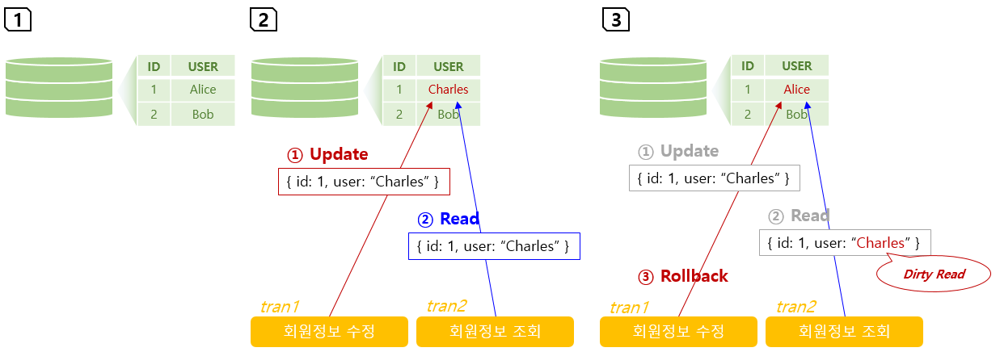
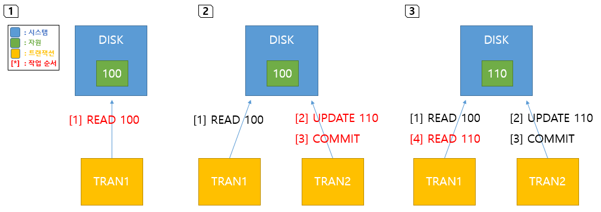
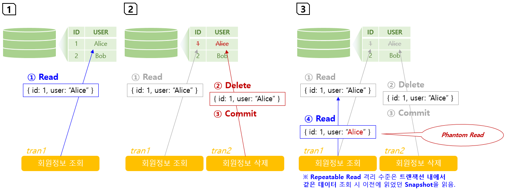

# Playground
- 회원관리를 위한 스프링부트 백엔드 서버

## 개발환경
- Spring Boot 2.x
- Gradle
- OpenJDK 14

## REST API 테이블
### 회원관리
| Method | Path | Description |
| --- | --- | --- |
| GET    | /api/members/{id} | 회원상세조회 |
| GET    | /api/members      | 회원목록조회 |
| POST   | /api/members      | 회원등록 |
| PUT    | /api/members/{id} | 회원수정(미구현) |
| DELETE | /api/members/{id} | 회원삭제 |

# 스터디
## 목차
1. [DB 다중화](#1-db-다중화)<br>
1.1. [DB 라우팅에 대한 이슈](#11-db-라우팅에-대한-이슈)<br>
1.1.1. [Annotation을 활용하여 DB 라우팅하기](#111-annotation을-활용하여-db-라우팅하기)<br>
1.2. [DB 동기화에 대한 이슈](#12-db-동기화에-대한-이슈)<br>
1.2.1. [CDC 솔루션](#121-cdc-솔루션)<br>
1.2.2. [격리 수준](#122-격리-수준)<br>
2. [JPA 동작방식](#2-jpa-동작방식)<br>
2.1. [JPA Bean 초기화 과정에 대해](#21-jpa-bean-초기화-과정에-대해)<br>
2.2. [JPA Repository interface 동작방식](#22-jpa-repository-interface-동작방식)<br>
3. [Spring Security 인증](#3-spring-security-인증)<br>
3.1. [JWT (JSON Web Token)](#31-jwt-json-web-token)<br>
3.1.1. [로그인 과정](#311-로그인-과정)<br>
3.1.2. [인증 과정](#312-인증-과정)<br>

## 1. DB 다중화

웹 서버나 WAS는 많은 이용자의 요청을 원활하게 처리하기 위해 여러 대를 배치하여 L4스위치 또는 *HCI\** 로 부하를 분산할 수 있다.

반면 DB를 다중화하려면 아래와 같이 2가지 고려할 점이 있다.
- 1.1. [DB 라우팅에 대한 이슈](#11-db-라우팅에-대한-이슈)
- 1.2. [DB 동기화에 대한 이슈](#12-db-동기화에-대한-이슈)

> **\* HCI (Hyper Converged Infrastructure)** : 수평 스케일링 장비<br>

### 1.1. DB 라우팅에 대한 이슈


위 그림과 같이 *Read/Write DB* 1대와 *Read-only DB\** 여러 대로 나눠 DB를 다중화한 환경이 있다.

Read 요청은 모든 DB를 대상으로 적절히 나눠 보내면 되므로 문제가 없다. 하지만 Write 요청은 Read/Write DB로만 보내야 하는데 L4 스위치에서는 이게 Read 요청인지 Write 요청인지 구분할 방법이 없다.

> **\* Read-only Database** : DB가 Read 작업만 처리하도록 설정한다. 주로 Write 요청을 수행하는 DB의 부담을 덜어주기 위해 Read 요청만 수행하는 DB를 다중화하여 사용한다.<br>
> **\*\* Read 요청** : SELECT<br>
> **\*\*\* Write 요청** : INSERT/UPDATE/DELETE<br>

### 1.1.1. Annotation을 활용하여 DB 라우팅하기


[DB 라우팅에 대한 이슈](#11-db-라우팅에-대한-이슈)를 해결하기 위해 위 그림과 같이 구상해봤다.

1. L4 스위치가 하지 못했던 Read/Write 구분을 WAS Application에서 수행하도록 한다.
2. Write 요청은 Read/Write DB로 바로 보내고, Read 요청은 L4 스위치를 거쳐 적절히 나눠 보낸다.

1번에서 Read/Write 요청을 구분하는 방법은 *Annotation\** 을 활용하여 아래와 같이 구현하였다.

> **\* Annotation** : 클래스/필드/메소드의 앞에 사용하여 대상의 메타 데이터를 표현할 수 있는 Java에서 제공하는 요소. 예를 들어, 메소드 앞에 <code>@Override</code> 어노테이션이 붙어있으면 해당 메소드는 부모클래스로부터 상속받았음을 의미한다.

#### 구현 과정 요약
1. DAO 메소드가 접근할 DB를 구분하는 Annotation을 만든다.
2. Write 작업이 필요한 메소드 앞에 해당 Annotation을 붙인다.
3. *AOP\** 를 통해 DAO 메소드 호출 전에 2번에서 붙인 Annotation이 있는지 체크한 후 DAO 메소드가 Read/Write DB에 해당하는 Data Source에 접근하도록 처리한다.

> **\* AOP(Aspect Oriented Programming)** : 어떤 메소드의 기능 수행 전/후에 공통적으로 수행하는 기능을 모듈화하는 것.

#### 구현 과정 상세
1. Annotation 추가

    DAO 메소드가 접근할 DB를 구분하는 Annotation을 추가한다.

    - [DbType.java](https://github.com/dragon20002/playground/blob/main/src/main/java/net/ldcc/playground/annotation/DbType.java)

      ```java
      @Target({ElementType.TYPE, ElementType.METHOD}) // Class나 Method 앞에 사용가능
      @Retention(RetentionPolicy.RUNTIME) // Annotation 수명 설정
      public @interface DbType {
          enum Profile { PRIMARY, SECONDARY }

          Profile profile() default Profile.PRIMARY; // Annotation 속성 및 기본값 설정

      }
      ```

2. Multiple Data Source 설정

    - [application.yaml](https://github.com/dragon20002/playground/blob/main/src/main/resources/application.yaml)

      <code>primary</code>와 <code>secondary</code>라는 이름을 가진 Data Source property를 정의한다.

      ```yaml
      spring:
      datasource:
          hikari:
          primary:
              jdbc-url: jdbc:h2:~/test
              driver-class-name: org.h2.Driver
              username: sa
              password:
          secondary:
              jdbc-url: jdbc:h2:~/playground
              driver-class-name: org.h2.Driver
              username: sa
              password:
      ```

    - [DataSourceProperties.java](https://github.com/dragon20002/playground/blob/main/src/main/java/net/ldcc/playground/config/db/DataSourceProperties.java)

      <code>primary</code>와 <code>secondary</code> property을 적용한 Data Source <code>Bean</code>을 생성한다.

      ```java
      @Configuration
      @EnableConfigurationProperties
      public class DataSourceProperties {

          @Bean(name = "primaryDataSource")
          @Qualifier("primaryDataSource")
          @Primary // 주 DataSource
          // property 값을 가져옴
          @ConfigurationProperties(prefix = "spring.datasource.hikari.primary")
          public DataSource primaryDataSource() {
              return DataSourceBuilder.create()
                      .type(HikariDataSource.class)
                      .build();
          }

          @Bean(name = "secondaryDataSource")
          @Qualifier("secondaryDataSource")
          @ConfigurationProperties(prefix = "spring.datasource.hikari.secondary")
          public DataSource secondaryDataSource() {
              return DataSourceBuilder.create()
                      .type(HikariDataSource.class)
                      .build();
          }
      }
      ```

    - Data Source 접근 시
      - Autowired 방식
        ```java
        @Autowired
        @Qualifier("secondaryDataSource")
        private DataSource dataSource;
        ```

      - 생성자 주입 방식
        ```java
        private final DataSource dataSource;

        public MyService(@Qualifier("secondaryDataSource") DataSource dataSource) {
            this.dataSource = dataSource;
        }
        ```

    > 참고링크<br>
    > [Spring Boot Multiple DataSource - 평생 공부만 해야할듯(blog)](https://gigas-blog.tistory.com/122)<br>

3. DAO 추가

    - [BaseDao.java](https://github.com/dragon20002/playground/blob/main/src/main/java/net/ldcc/playground/dao/BaseDao.java)

      <code>JdbcTemplate</code>을 가진 추상클래스

      ```java
      public abstract class BaseDao {
          private final ApplicationContext context;
          protected final JdbcTemplate jdbcTemplate;
          private DbType.Profile profile = DbType.Profile.PRIMARY;

          public BaseDao(ApplicationContext context, JdbcTemplate jdbcTemplate) {
              this.context = context;
              this.jdbcTemplate = jdbcTemplate;
          }

          /*** Data source를 전환하기 위한 메소드 ***/

          /**
           * @return 현재 DbType을 반환한다.
           */
          public DbType.Profile getProfile() {
              return profile;
          }

          /**
           * @param profile 전환할 Data source의 profile
           */
          public void setDataSource(DbType.Profile profile) {
              if (profile == null)
                  return;

              this.profile = profile;

              DataSource dataSource = switch (profile) {
                  case PRIMARY -> (DataSource) context.getBean("primaryDataSource");
                  case SECONDARY -> (DataSource) context.getBean("secondaryDataSource");
              };

              jdbcTemplate.setDataSource(dataSource);
          }
      }
      ```

    - [MemberDao.java](https://github.com/dragon20002/playground/blob/main/src/main/java/net/ldcc/playground/dao/MemberDao.java)
    
      CRUD를 구현한 <code>MemberDao</code> 생성. <code>BaseDao</code> 클래스를 상속해야 한다.

      ```java
      @Component
      public class MemberDao extends BaseDao {

          public MemberDao(ApplicationContext context, JdbcTemplate jdbcTemplate) {
              super(context, jdbcTemplate);
          }

          public Member findById(Long id) {
              String sql = "SELECT * FROM MEMBER WHERE ID = ?";
              return jdbcTemplate.queryForObject(sql, new Object[]{id}, new MemberRowMapper());
          }

          public MemberSec findByIdSec(Long id) {
              String sql = "SELECT ID, USER_ID, NAME, TEL_NO, EMAIL, ADDRESS, EXPR_DATE FROM MEMBER WHERE ID = ?";
              return jdbcTemplate.queryForObject(sql, new Object[]{id}, new MemberSecRowMapper());
          }
          ...
      }
      ```

4. (AOP) Aspect 추가

    - [DataSourceAspect.java](https://github.com/dragon20002/playground/blob/main/src/main/java/net/ldcc/playground/aop/DataSourceAspect.java)

      - Point Cut : DAO 패키지의 메소드 호출 시
      - Aspect 기능 요약
        1. <code>StackTrace</code>로 DAO 메소드를 호출한 Controller/Service의 클래스/메소드를 찾는다.
        2. 클래스/메소드에 <code>DbType</code> Annotation이 있는지 확인하고 <code>DbType.profile</code> 값을 가져온다.
        3. <code>profile</code> 값이 DAO에 설정된 <code>JdbcTemplate</code>의 Data source와 다른지 확인한다.
        4. 다르면 DAO에 Lock을 걸고 <code>profile</code>에 맞는 Data source로 전환한다.
        5. DAO 메소드 실행
        6. *(선택사항) 이전에 연동되어 있던 Data source로 다시 전환한다.*
        7. DAO에 대한 Lock 해제

      ```java
      @Around("execution(* net.ldcc.playground.dao..*.*(..))") // [PointCut] DAO 패키지의 메소드 실행
      public Object switchDataSource(ProceedingJoinPoint pjp) throws Throwable {
          @SuppressWarnings("rawtypes")
          Class cls = pjp.getSignature().getDeclaringType();
          String clsName = pjp.getSignature().getDeclaringTypeName();
          String mtdName = pjp.getSignature().getName();

          // StackTrace to find the controller/service method has called current method
          StackTraceElement[] stackTrace = Thread.currentThread().getStackTrace();

          // > [DEBUG] Print StackTrace
          Arrays.stream(stackTrace).forEach(t -> logger.debug("StackTrace : {}.{}", t.getClassName(), t.getMethodName()));

          // > Find the current method's position
          Iterator<StackTraceElement> iter = Arrays.stream(stackTrace).iterator();
          while (iter.hasNext()) {
              StackTraceElement element = iter.next();
              if (element.getClassName().contains(clsName) && element.getMethodName().equals(mtdName)) {
                  break;
              }
          }

          // > Check 'DbType' Annotation
          DbType.Profile profile = null;
          if (iter.hasNext()) {
              StackTraceElement stSvc = iter.next(); // (DAO 메소드를 호출한 Service)

              // >> Service
              @SuppressWarnings("rawtypes")
              Class clsSvc = Class.forName(stSvc.getClassName());
              Method mtdSvc = Arrays.stream(clsSvc.getDeclaredMethods())
                      .filter(m -> m.getName().equals(stSvc.getMethodName()))
                      .findFirst()
                      .orElse(null);

              if (clsSvc.isAnnotationPresent(DbType.class)) {
                  DbType dbType = (DbType) clsSvc.getAnnotation(DbType.class);
                  profile = dbType.profile();
              } else if (mtdSvc != null && mtdSvc.isAnnotationPresent(DbType.class)) {
                  DbType dbType = mtdSvc.getAnnotation(DbType.class);
                  profile = dbType.profile();
              }

              // >> Controller
              if (iter.hasNext() && profile == null) {
                  StackTraceElement stCtrl = iter.next(); // (Service 메소드를 호출한 Controller)

                  @SuppressWarnings("rawtypes")
                  Class clsCtrl = Class.forName(stCtrl.getClassName());
                  Method mtdCtrl = Arrays.stream(clsCtrl.getDeclaredMethods())
                          .filter(m -> m.getName().equals(stCtrl.getMethodName()))
                          .findFirst()
                          .orElse(null);

                  if (clsCtrl.isAnnotationPresent(DbType.class)) {
                      DbType dbType = (DbType) clsCtrl.getAnnotation(DbType.class);
                      profile = dbType.profile();
                  } else if (mtdCtrl != null && mtdCtrl.isAnnotationPresent(DbType.class)) {
                      DbType dbType = mtdCtrl.getAnnotation(DbType.class);
                      profile = dbType.profile();
                  }
              }
          }

          // [DEBUG] Selected DbType Profile
          logger.debug("DbType.Profile={}", profile);

          // Switch data source
          @SuppressWarnings("rawtypes")
          BaseDao dao = (BaseDao) context.getBean(cls);
          Object result;

          // > Lock/UnLock data source
          synchronized (dao) {
              if (profile != null) {
                  DbType.Profile prevProfile = dao.getProfile();
                  dao.setDataSource(profile); // switch data source
                  result = pjp.proceed(); // proceed dao method
                  dao.setDataSource(prevProfile); // restore data source

              } else {
                  result = pjp.proceed();
              }
          }

          return result;
      }
      ```

5. 사용 예
    - Controller/Service 클래스에 사용 시, 해당 클래스의 모든 메소드를 대상으로 적용된다.
        ```java
        @DbType(profile = DbType.Profile.SECONDARY)
        @RestController
        public class MemberRestController {
            private final MemberService memberService;
            ...
        }
        ```

    - Controller/Service의 메소드에 사용 시, 해당 메소드에만 적용된다.
        ```java
        @DbType(profile = DbType.Profile.SECONDARY)
        @GetMapping("/api/members")
        public ResponseEntity<List<MemberSec>> getMembers() {
            List<MemberSec> memberList = memberService.getMembersSec();

            return new ResponseEntity<>(memberList, HttpStatus.OK);
        }
        ```

6. 제약사항
    - JdbcTemplate 활용 (JPA 활용불가)
    - 여러 요청이 같은 DAO에 동시 접근하는 경우 상호배제로 인한 성능 저하
    - 그리고 또...?

7. TODO
    - 2-Phase Commit 스터디
    - JDBC 로드밸런싱 기능에 대해
      - Web서버나 WAS가 아닌, DB를 대상으로 라우팅할 수 있도록 지원됨
    - Read/Write용 DB, Read용 DB에 적용할 수 있을지 고민해볼 것
      - MySQL, PostgreSQL 등은 Read/Write용 DB, Read용 DB로 나눠 동기화하는 기능이 있음
      - xlog, cdc 등 동기화솔루션 조사
      - DB 다중화 및 동기화 설정 해보기

### 1.2. DB 동기화에 대한 이슈


Read/Write DB에 Write 작업 후 동기화가 제 때 이뤄지지 않으면 같은 요청이라도 서로 다른 응답 결과를 받게 된다.

동기화 기능은 *CDC* 솔루션을 통해 구현할 수 있다. CDC 동기화 기술과 트랜잭션 격리 수준에 대해 정리하였다.

- 1.2.1. [CDC 솔루션](#121-cdc-솔루션)
- 1.2.2. [격리 수준](#122-격리-수준)

### 1.2.1. CDC 솔루션

CDC(Change Data Capture)는 데이터베이스의 트랜잭션 Log 파일로부터 변경 데이터를 추출하여 다른 데이터베이스와 데이터를 실시간으로 동기화하는 기술이다.

- 동기화 방식
  | 방식 | 설명 |
  | --- | --- |
  | Trigger | 대상 테이블에 Trigger를 적용하여 DML 발생 시 로그 테이블에 기록하여 변경   데이터 추출 |
  | Timestamp | 테이블의 Timestamp 컬럼 기준으로 변경 데이터 추출 |
  | Direct Log Access | DB Redo Log 파일에 접근 및 분석하여 변경 데이터 추출 |

- 솔루션 종류
  - MySQL Replication
  - PostgresQL Sync Replication
  - X-LOG
  - Oracle Golden Gate
  - Debezium

> 참고링크<br>
> [CDC 솔루션 - ArkData](https://www.dqc.or.kr/wp-content/uploads/2019/11/T3.%EC%86%94%EB%A3%A8%EC%85%984_%EB%8D%B0%EC%9D%B4%ED%83%80%EB%B1%85%ED%81%AC%EC%8B%9C%EC%8A%A4%ED%85%9C%EC%A6%88_%EA%B6%8C%EA%B8%B0%EC%9A%B1_%EC%A0%84%EB%AC%B4.pdf)<br>
> [아는 사람만 아는 데이터 동기화 기술 - 한국데이터산업진흥원](https://www.kdata.or.kr/info/info_04_view.html?field=&keyword=&type=techreport&page=3&dbnum=189554&mode=detail&type=techreport)<br>
> [MySQL Replication을 이용하여 DBMS 단방향 이중화하기 - 서버구축이야기 tistory blog](https://stackoverflow.com/questions/7707859/mysql-database-sync-between-two-databases)<br>
> [PostgreSQL Sync Replication Guide - HEVO 포럼](https://hevodata.com/learn/postgresql-sync-replication/)<br>

### 1.2.2. 격리 수준
- 격리 수준

  다수의 트랜잭션을 동시 처리 시 발생하는 문제들은 트랜잭션의 격리성을 조절하여 해결할 수 있다. 격리 수준이 높아질 수록 동시성이 낮아지므로 성능을 고려하여 조절해야 한다.

  격리성 비교 : (낮음) <code>Read Uncommitted</code> < <code>Read Committed</code> < <code>Non-Repeatable Read</code> < <code>Serializable</code> (높음)
  > \* 아래 항목 중 <code>RCSI</code>는 MS SQL Server의 <code>Read Committed</code> 격리 수준에서 사용 가능한 옵션으로 다른 격리 수준과 비교하기 애매하여 비교 대상에서 제외함.

  | 격리 수준 | 동작 방식 | <font color="red">Issues</font> |
  | --- | --- | --- |
  | *Read Uncommitted* | 한 트랜잭션에서 아직 커밋하지 않은 데이터에 다른 트랜잭션이 접근할 수 있다. | <font color="red">Dirty Read,<br>Non-Repeatable Read,<br>Phantom Read</font> |
  | *Read Committed* <code>기본값</code> | 커밋이 완료된 데이터만 읽을 수 있다.| <font color="red">Non-Repeatable Read,<br>Phantom Read</font> |
  | *Repeatable Read* | 트랜잭션 내에서 한번 조회한 데이터는 다른 트랜잭션에서 값이 변경되어도 반복 조회 시 이전과 같은 데이터로 조회한다.| <font color="red">Phantom Read</font> |
  | *Serializable* | SELECT 시 *공유 잠금\*\** <br>INSERT/UPDATE/DELETE 시 *배타적 잠금\*\*\** | <font color="red">잠금으로 인한 동시성 감소</font> |
  | *Snapshot* | Serializable과 동일한 격리 수준이지만, 잠금된 테이블에 대해 INSERT/DELETE 작업을 임시테이블(snapshot)에서 진행한 후, 잠금해제되면 임시테이블 변경내용을 적용한다. | <font color="red">잠금으로 인한 동시성 감소</font> |
  | *Read Committed Snapshot (RCSI)* | 잠금을 사용하지 않고, 트랜잭션 시작 전에 가장 최근에 커밋된 스냅샷을 불러와 작업을 수행한다. | <font color="red">서로 다른 트랜잭션 사이에 Commit 내용의 충돌 위험</font><br><font color="sky-blue">→ 별도의 충돌감지 및 처리 필요</font> |

  > <b>\*\* 공유 잠금 : </b>자원을 공유하기 위한 잠금으로, 다른 트랜잭션에서 공유 잠금(읽기)는 가능하지만 배타적 잠금(쓰기)은 걸 수 없다.<br>
  > <b>\*\*\* 배타적 잠금 : </b>자원을 수정하기 위한 잠금으로, 다른 트랜잭션에서 공유 잠금(읽기), 배타적 잠금(수정)을 걸 수 없다.

- 격리 수준 이슈
1. Dirty Read

    

    - **격리 수준** <br>
      Read Uncommitted 격리 수준에서 발생
    
    - **이슈** <br>
      TRAN2 트랜잭션이 아직 커밋되지 않은 변경된 데이터를 읽었는데, TRAN1 트랜잭션이 롤백하여 ***의미없는 데이터를 가지게 되는 경우*** 를 'Dirty Read'라고 한다.
    
    - **해결 방법** <br>
      커밋된 데이터만 읽을 수 있는 Read Committed 이상의 격리 수준으로 해결할 수 있다.

2. Non-Repeatable Read

    

    - **격리 수준** <br>
      Read Uncommitted, Read Committed 격리 수준에서 발생
    
    - **이슈** <br>
      TRAN1이 여러 번 같은 데이터를 읽는 도중에 TRAN2가 데이터 변경 후 커밋하여 TRAN1 ***트랜잭션이 Read할 때마다 같은 데이터에서 다른 값을 읽게 되는 경우*** 를 'Non-Repeatable Read'라고 한다.
    
    - **해결 방법** <br>
      한 트랜잭션에서 같은 데이터를 여러 번 읽을 때 처음 Read한 값을 사용하도록 하는 Repeatable Read 이상의 격리 수준으로 해결할 수 있다.

3. Phantom Read

    

    - **격리 수준** <br>
      Read Uncommitted, Read Committed, Repeatable Read 격리 수준에서 발생
    
    - **이슈** <br>
      TRAN1 트랜잭션이 같은 데이터를 여러 번 읽는 도중에 TRAN2가 데이터를 추가/삭제하여 TRAN1 ***트랜잭션 도중에 읽을 데이터가 추가*** 되거나 ***존재하지 않는 데이터를 가지게 된 경우*** 를 'Phantom Read(가상 읽기)'라고 한다.
    
    - **해결 방법** <br>
      공유 잠금, 배타적 잠금을 수행하는 Serializable 이상의 격리 수준으로 해결한다.

> 참고링크<br>
> [트랜잭션, 트랜잭션 격리수준 - wmJun(blog)](https://feco.tistory.com/45)<br>
> [SQL Server RCSRI - BrentOzar(blog)](https://www.brentozar.com/archive/2013/01/implementing-snapshot-or-read-committed-snapshot-isolation-in-sql-server-a-guide/)<br>

## 2. JPA 동작방식

### 2.1. JPA Bean 초기화 과정에 대해
```java
// TODO
```

### 2.2. JPA Repository interface 동작방식

Repository interface에 대한 코드 생성은 하지 않는다. Spring의 <code>ProxyFacory</code> API가 JDK 프록시 인스턴스를 생성한 다음, Repository의 메소드가 호출될 때마다 <code>MethodInterceptor</code>를 호출하여 아래와 같이 DB 작업을 수행한다.

1. Repository interface의 메소드를 호출하면 <code>MethodInterceptor</code>가 작동한다.
    ```java
    List<Member> memberList = memberRepository.findAllByUserId(userId);
    ```

2. <code>SimpleJpaRepository</code> 등에 구현된 메소드를 호출한다.
    ```java
    List<Member> memberList = memberRepository.findAll();
    ```

3. 직접 생성한 <code>@Query</code> 메소드인 경우, <code>JpaQueryLookupStrategy</code>가 메소드 이름을 구문분석하고 <code>JpaQueryCreator</code>로 쿼리를 생성한다.
    ```java
    @Query
    public List<Member> findAllByUserId(String userId);
    ```

> 참고링크<br>
> [how-are-spring-data-repositories-actually-implemented - StackOverflow](https://stackoverflow.com/questions/38509882/how-are-spring-data-repositories-actually-implemented)<br>

## 3. Spring Security 인증
### 3.1. JWT (JSON Web Token)
### 3.1.1. 로그인 과정
<code>UsernamePasswordAuthenticationFilter</code> → <code>AuthenticationProvider</code> → <code>SavedRequestAwareAuthenticationSuccessHandler</code>

1. <code>UsernamePasswordAuthenticationFilter</code>

    request로부터 username/password 입력값을 가져온다.

    ```java
    public class AuthFilter extends UsernamePasswordAuthenticationFilter {

        public AuthFilter(AuthenticationManager authenticationManager) {
            super.setAuthenticationManager(authenticationManager);
        }

        @Override
        public Authentication attemptAuthentication(HttpServletRequest request,
                HttpServletResponse response) throws AuthenticationException {
            UsernamePasswordAuthenticationToken authRequest;
            try {
                // Request Body로부터 username/password를 가져와
                // UserDetails를 상속받은 클래스에 매핑
                Member member = new ObjectMapper().readValue(request.getInputStream(), Member.class);
                authRequest = new UsernamePasswordAuthenticationToken(member.getUsername(), member.getPassword());
            } catch (IOException e) {
                throw new InputMismatchException();
            }

            setDetails(request, authRequest);

            // 인증 시도 (AuthenticationProvider 호출)
            return getAuthenticationManager().authenticate(authRequest);
        }
    }
    ```

2. <code>AuthenticationProvider</code>

    인증 시도하여 성공한 경우 <code>UsernamePasswordAuthenticationToken</code>을 생성/반환하고 실패한 경우 Exception을 발생시킨다.

    ```java
    public class BaseAuthProvider implements AuthenticationProvider {
        private final Logger logger = LoggerFactory.getLogger(BaseAuthProvider.class);

        private final MemberRepository memberRepository;
        private final BCryptPasswordEncoder bCryptPasswordEncoder;

        public BaseAuthProvider(MemberRepository memberRepository, BCryptPasswordEncoder bCryptPasswordEncoder) {
            this.memberRepository = memberRepository;
            this.bCryptPasswordEncoder = bCryptPasswordEncoder;
        }

        @Override
        public Authentication authenticate(Authentication authentication) throws AuthenticationException {
            String username = (String) authentication.getPrincipal();
            String password = (String) authentication.getCredentials();

            List<Member> memberList = memberRepository.findAllByUsername(username);
            Member member = memberList.stream()
                    .filter(Member::isAccountNonExpired)
                    .findFirst()
                    .filter(m -> bCryptPasswordEncoder.matches(password, m.getPassword()))
                    .orElseThrow(() -> new BadCredentialsException("Invalid Password for " + username));

            return new UsernamePasswordAuthenticationToken(member, password, member.getAuthorities());
        }

        @Override
        public boolean supports(Class<?> authentication) {
            return authentication.equals(UsernamePasswordAuthenticationToken.class);
        }

    }
    ```

3. <code>SavedRequestAwareAuthenticationSuccessHandler</code>

    인증 성공 시 Handler를 통해 JWT 토큰을 생성하여 Header에 넣는다.

    ```java
    public class LoginSuccessHandler extends SavedRequestAwareAuthenticationSuccessHandler {
        private final Logger logger = LoggerFactory.getLogger(LoginSuccessHandler.class);

        private final JwtTokenProvider jwtTokenProvider;

        public LoginSuccessHandler(JwtTokenProvider jwtTokenProvider) {
            this.jwtTokenProvider = jwtTokenProvider;
        }

        @Override
        public void onAuthenticationSuccess(HttpServletRequest request, HttpServletResponse response, Authentication authentication) throws ServletException, IOException {
            Member member = ((Member) authentication.getPrincipal());
            String token = jwtTokenProvider.createToken(member.getUsername()); //JWT 토큰 생성
            logger.debug("token={}", token);

            response.addHeader("jws", token);
            response.setStatus(HttpServletResponse.SC_OK);
        }

    }
    ```

### 3.1.2. 인증 과정
<code>HandlerInterceptorAdapter</code> > 인증 필수 요청의 Controller

1. <code>HandlerInterceptorAdapter</code>

    인증을 위해 Header의 JWT 토큰을 체크하여 누락되거나 만료된 경우 401 Unauthorized 에러로 리다이렉션한다.

    ```java
    public class AuthInterceptor extends HandlerInterceptorAdapter {
        private final Logger logger = LoggerFactory.getLogger(AuthInterceptor.class);

        private final JwtTokenProvider jwtTokenProvider;

        public AuthInterceptor(JwtTokenProvider jwtTokenProvider) {
            this.jwtTokenProvider = jwtTokenProvider;
        }

        @Override
        public boolean preHandle(HttpServletRequest request,
                HttpServletResponse response, Object handler) throws Exception {
            String jws = request.getHeader("jws");
            String sub = jwtTokenProvider.getSubject(jws); // JWT 토큰 내용

            if (sub == null) {
                response.sendRedirect("/error/unauthorized");
                return false;
            }

            return true;
        }

    }
    ```

2. 인증 필수 요청의 Controller

    인증이 필요한 요청을 처리하는 작업 수행
